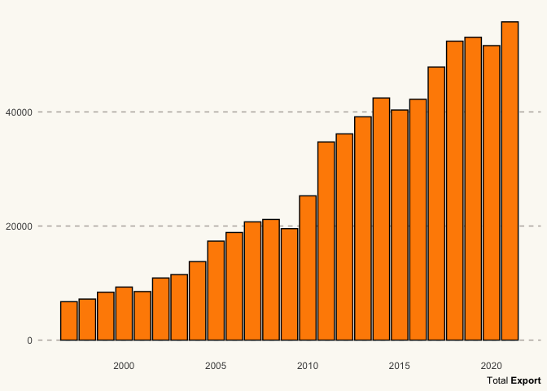

India_Exports
================
Karat Sidhu
2022-03-23

``` r
library(tidyverse)
```

    ## ── Attaching packages ─────────────────────────────────────── tidyverse 1.3.1 ──

    ## ✓ ggplot2 3.3.5     ✓ purrr   0.3.4
    ## ✓ tibble  3.1.6     ✓ dplyr   1.0.8
    ## ✓ tidyr   1.2.0     ✓ stringr 1.4.0
    ## ✓ readr   2.1.2     ✓ forcats 0.5.1

    ## ── Conflicts ────────────────────────────────────────── tidyverse_conflicts() ──
    ## x dplyr::filter() masks stats::filter()
    ## x dplyr::lag()    masks stats::lag()

``` r
library(ggtext)
library(lubridate)
```

    ## 
    ## Attaching package: 'lubridate'

    ## The following objects are masked from 'package:base':
    ## 
    ##     date, intersect, setdiff, union

``` r
library(patchwork)
library(hrbrthemes)
```

    ## NOTE: Either Arial Narrow or Roboto Condensed fonts are required to use these themes.

    ##       Please use hrbrthemes::import_roboto_condensed() to install Roboto Condensed and

    ##       if Arial Narrow is not on your system, please see https://bit.ly/arialnarrow

``` r
exports_master <- read_csv("exports and imports of india(1997-2022) - exports and imports.csv")
```

    ## Rows: 5767 Columns: 7
    ## ── Column specification ────────────────────────────────────────────────────────
    ## Delimiter: ","
    ## chr (1): Country
    ## dbl (2): Year(start), Year(end)
    ## 
    ## ℹ Use `spec()` to retrieve the full column specification for this data.
    ## ℹ Specify the column types or set `show_col_types = FALSE` to quiet this message.

``` r
USA_trade <- exports_master %>%
  filter(Country == "U S A")
USA_trade
```

    ## # A tibble: 25 × 7
    ##    Country Export Import `Total Trade` `Trade Balance` `Year(start)` `Year(end)`
    ##    <chr>    <dbl>  <dbl>         <dbl>           <dbl>         <dbl>       <dbl>
    ##  1 U S A    6735.  3714.        10450.           3021.            97          98
    ##  2 U S A    7200.  3640.        10840.           3559.            98          99
    ##  3 U S A    8396.  3560.        11956.           4835.            99        2000
    ##  4 U S A    9305.  3015         12320.           6290.          2000        2001
    ##  5 U S A    8513.  3150.        11663.           5364.          2001        2002
    ##  6 U S A   10896.  4444.        15339.           6452.          2002        2003
    ##  7 U S A   11490.  5035.        16525.           6455.          2003        2004
    ##  8 U S A   13766.  7001.        20767.           6764.          2004        2005
    ##  9 U S A   17353.  9455.        26808.           7898.          2005        2006
    ## 10 U S A   18863. 11738.        30602.           7125.          2006        2007
    ## # … with 15 more rows

``` r
USA_trade$`Year(start)` <-
  lubridate::parse_date_time(USA_trade$`Year(start)`, '%y')
USA_trade$`Total Trade` <- as.integer(USA_trade$`Total Trade`)

USA_trade
```

    ## # A tibble: 25 × 7
    ##    Country Export Import `Total Trade` `Trade Balance` `Year(start)`      
    ##    <chr>    <dbl>  <dbl>         <int>           <dbl> <dttm>             
    ##  1 U S A    6735.  3714.         10449           3021. 1997-01-01 00:00:00
    ##  2 U S A    7200.  3640.         10839           3559. 1998-01-01 00:00:00
    ##  3 U S A    8396.  3560.         11955           4835. 1999-01-01 00:00:00
    ##  4 U S A    9305.  3015          12320           6290. 2000-01-01 00:00:00
    ##  5 U S A    8513.  3150.         11662           5364. 2001-01-01 00:00:00
    ##  6 U S A   10896.  4444.         15339           6452. 2002-01-01 00:00:00
    ##  7 U S A   11490.  5035.         16524           6455. 2003-01-01 00:00:00
    ##  8 U S A   13766.  7001.         20767           6764. 2004-01-01 00:00:00
    ##  9 U S A   17353.  9455.         26807           7898. 2005-01-01 00:00:00
    ## 10 U S A   18863. 11738.         30601           7125. 2006-01-01 00:00:00
    ## # … with 15 more rows, and 1 more variable: `Year(end)` <dbl>

``` r
USA_trade_net <- USA_trade %>%
  mutate(total_profit = (Export - Import))
USA_trade_net
```

    ## # A tibble: 25 × 8
    ##    Country Export Import `Total Trade` `Trade Balance` `Year(start)`      
    ##    <chr>    <dbl>  <dbl>         <int>           <dbl> <dttm>             
    ##  1 U S A    6735.  3714.         10449           3021. 1997-01-01 00:00:00
    ##  2 U S A    7200.  3640.         10839           3559. 1998-01-01 00:00:00
    ##  3 U S A    8396.  3560.         11955           4835. 1999-01-01 00:00:00
    ##  4 U S A    9305.  3015          12320           6290. 2000-01-01 00:00:00
    ##  5 U S A    8513.  3150.         11662           5364. 2001-01-01 00:00:00
    ##  6 U S A   10896.  4444.         15339           6452. 2002-01-01 00:00:00
    ##  7 U S A   11490.  5035.         16524           6455. 2003-01-01 00:00:00
    ##  8 U S A   13766.  7001.         20767           6764. 2004-01-01 00:00:00
    ##  9 U S A   17353.  9455.         26807           7898. 2005-01-01 00:00:00
    ## 10 U S A   18863. 11738.         30601           7125. 2006-01-01 00:00:00
    ## # … with 15 more rows, and 2 more variables: `Year(end)` <dbl>,
    ## #   total_profit <dbl>

``` r
p1 <-
  ggplot(USA_trade_net, mapping = aes(x = `Year(start)`, y = `Total Trade`)) +
  geom_line(aes(x = `Year(start)`, y = `Total Trade`),
            size = 0.5,
            color = "darkorange") +
  geom_point(aes(x = `Year(start)`, y = `Total Trade`),
             size = 2,
             color = "darkorange") +
  labs(caption = " **Total** Import + Export") +
  theme(plot.title = ggtext::element_markdown()) +
  theme(plot.caption = element_markdown()) +
  theme( 
    panel.grid.minor = element_blank(),
    panel.grid.major.x = element_blank(),
    panel.grid.major.y = element_line(color = "#b4aea9", linetype = "dashed"),
    
    # Use a light color for the background of the plot and the panel.
    panel.background = element_rect(fill = "#fbf9f4", color = "#fbf9f4"),
    plot.background = element_rect(fill = "#fbf9f4", color = "#fbf9f4"),
    axis.title.x = element_blank()
  )

p1
```

<!-- -->

``` r
p2 <-
  ggplot(
    USA_trade_net,
    mapping = aes(
      x = `Year(start)`,
      y = `Import`,
      fill = "darkorange",
      color = "black"
    )
  ) +
  geom_col(aes()) +
  theme(plot.title = ggtext::element_markdown(hjust = 0)) +
  theme_minimal() +
  theme(plot.caption = element_markdown()) +
  theme(axis.title.y = element_blank(),
        axis.title.x = element_blank()) +
  theme(
    panel.grid.minor = element_blank(),
    panel.grid.major.x = element_blank(),
    panel.grid.major.y = element_line(color = "#b4aea9", linetype = "dashed"),
    
    # Use a light color for the background of the plot and the panel.
    panel.background = element_rect(fill = "#fbf9f4", color = "#fbf9f4"),
    plot.background = element_rect(fill = "#fbf9f4", color = "#fbf9f4")
  ) + scale_fill_manual(values = "#00008B", labels = NULL) +
  labs(caption = " Total **Import**") +
  scale_color_manual(values = "black") +
  theme(legend.position = "none") + theme(plot.caption = element_markdown())
```

``` r
p3 <-
  ggplot(
    USA_trade_net,
    mapping = aes(
      x = `Year(start)`,
      y = `Export`,
      fill = "darkorange",
      color = "black"
    )
  ) +
  geom_col()  +
  theme(plot.title = ggtext::element_markdown(hjust = 0)) +
  theme_minimal() +
  theme(plot.caption = element_markdown()) +
  theme(axis.title.y = element_blank(),
        axis.title.x = element_blank()) +
  theme(
    panel.grid.minor = element_blank(),
    panel.grid.major.x = element_blank(),
    panel.grid.major.y = element_line(color = "#b4aea9", linetype = "dashed"),
    
    # Use a light color for the background of the plot and the panel.
    panel.background = element_rect(fill = "#fbf9f4", color = "#fbf9f4"),
    plot.background = element_rect(fill = "#fbf9f4", color = "#fbf9f4")
  ) + scale_fill_manual(values = "#FF8C00", labels = NULL) +
  labs(caption = " Total **Export**") +
  scale_color_manual(values = "black") +
  theme(legend.position = "none") + theme(plot.caption = element_markdown())

p3
```

<!-- -->

``` r
p4 <-
  ggplot(USA_trade_net, mapping = aes(x = `Year(start)`, y = total_profit)) +
  geom_line(aes(), size = 0.9) +
  geom_point(aes(), size = 1.5) +
  labs(caption = " <span style = 'color:darkorange'>**Profit**</span> =  export - import") +
  theme_minimal() +
  theme(plot.title = ggtext::element_markdown()) +
  theme(plot.caption = element_markdown())  +
  theme(
    panel.grid.minor = element_blank(),
    panel.grid.major.x = element_blank(),
    panel.grid.major.y = element_line(color = "#b4aea9", linetype = "dashed"),
    # Use a light color for the background of the plot and the panel.
    panel.background = element_rect(fill = "#fbf9f4", color = "#fbf9f4"),
    plot.background = element_rect(fill = "#fbf9f4", color = "#fbf9f4")
  ) + ylab("Total Profit Observed")
```

``` r
plot_master <- (p1 + (p2 / p3)) / p4
plot_final <- plot_master + plot_annotation(
  title = 'Import and Export Trends between India and USA',
  subtitle = 'A Brief Overview of the profit over the years between the two countries and its general trend.',
  caption = 'Disclaimer: Unit of Revenue was not provided in the original dataset',
  theme = theme(
    plot.title = element_text(hjust = 0, face = "bold",),
    plot.background = element_rect(fill = "whitesmoke")
  )
) 
```

``` r
ggsave(
  filename = "survival-curves.png",
  plot = print(plot_final),
  width = 20,
  height = 16,
  dpi = 250
)
```

<!-- -->
