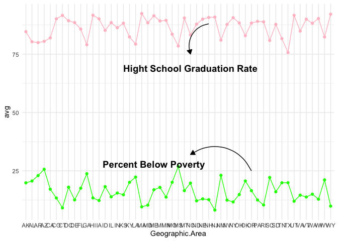
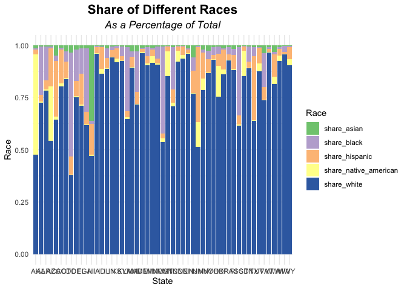

US_Justice
================
Karat Sidhu
2022-03-31

# Introduction

Since Jan. 1, 2015, [The Washington
Post](https://www.washingtonpost.com/) has been compiling a database of
every fatal shooting in the US by a police officer in the line of duty.

<center>

</center>

While there are many challenges regarding data collection and reporting,
The Washington Post has been tracking more than a dozen details about
each killing. This includes the race, age and gender of the deceased,
whether the person was armed, and whether the victim was experiencing a
mental-health crisis. The Washington Post has gathered this supplemental
information from law enforcement websites, local new reports, social
media, and by monitoring independent databases such as “Killed by
police” and “Fatal Encounters”. The Post has also conducted additional
reporting in many cases.

There are 4 additional datasets: US census data on poverty rate, high
school graduation rate, median household income, and racial
demographics. [Source of census
data](https://factfinder.census.gov/faces/nav/jsf/pages/community_facts.xhtml).

# Loading Packages

``` r
library(tidyverse)
```

    ## ── Attaching packages ─────────────────────────────────────── tidyverse 1.3.1 ──

    ## ✓ ggplot2 3.3.5     ✓ purrr   0.3.4
    ## ✓ tibble  3.1.6     ✓ dplyr   1.0.8
    ## ✓ tidyr   1.2.0     ✓ stringr 1.4.0
    ## ✓ readr   2.1.2     ✓ forcats 0.5.1

    ## ── Conflicts ────────────────────────────────────────── tidyverse_conflicts() ──
    ## x dplyr::filter() masks stats::filter()
    ## x dplyr::lag()    masks stats::lag()

# Datasets to use:

df_hh_income = pd.read_csv(‘Median_Household_Income_2015.csv’,
encoding=“windows-1252”) df_pct_poverty =
pd.read_csv(‘Pct_People_Below_Poverty_Level.csv’,
encoding=“windows-1252”) df_pct_completed_hs =
pd.read_csv(‘Pct_Over_25_Completed_High_School.csv’,
encoding=“windows-1252”) df_share_race_city =
pd.read_csv(‘Share_of_Race_By_City.csv’, encoding=“windows-1252”)
df_fatalities = pd.read_csv(‘Deaths_by_Police_US.csv’,
encoding=“windows-1252”)

``` r
hh_income <- read.csv("Median_Household_Income_2015.csv")
pct_poverty<- read.csv("Pct_People_Below_Poverty_Level.csv")
pct_completed_hs <- read.csv("Pct_Over_25_Completed_High_School.csv")
share_race_city <- read.csv("Share_of_Race_By_City.csv")
fatalities <- read.csv("Deaths_by_Police_US.csv")
```

# Preliminary Data Exploration

-   What is the shape of the DataFrames?
-   How many rows and columns do they have?
-   What are the column names?
-   Are there any NaN values or duplicates?

### Shape of Data

``` r
dim(share_race_city)
```

    ## [1] 29268     7

``` r
dim(fatalities)
```

    ## [1] 2535   14

``` r
dim(hh_income)
```

    ## [1] 29322     3

``` r
dim(pct_completed_hs)
```

    ## [1] 29329     3

``` r
dim(pct_poverty)
```

    ## [1] 29329     3

### Column names

``` r
colnames(share_race_city)
```

    ## [1] "Geographic.area"       "City"                  "share_white"          
    ## [4] "share_black"           "share_native_american" "share_asian"          
    ## [7] "share_hispanic"

``` r
colnames(fatalities)
```

    ##  [1] "id"                      "name"                   
    ##  [3] "date"                    "manner_of_death"        
    ##  [5] "armed"                   "age"                    
    ##  [7] "gender"                  "race"                   
    ##  [9] "city"                    "state"                  
    ## [11] "signs_of_mental_illness" "threat_level"           
    ## [13] "flee"                    "body_camera"

``` r
colnames(hh_income)
```

    ## [1] "Geographic.Area" "City"            "Median.Income"

``` r
colnames(pct_completed_hs)
```

    ## [1] "Geographic.Area"      "City"                 "percent_completed_hs"

``` r
colnames(pct_poverty)
```

    ## [1] "Geographic.Area" "City"            "poverty_rate"

## Data Cleaning - Check for Missing Values and Duplicates

Consider how to deal with the NaN values. Perhaps substituting 0 is
appropriate.

``` r
any(is.na(fatalities))
```

    ## [1] TRUE

``` r
any(is.na(hh_income))
```

    ## [1] FALSE

``` r
any(is.na(pct_completed_hs))
```

    ## [1] FALSE

``` r
any(is.na(pct_poverty))
```

    ## [1] FALSE

``` r
any(is.na(share_race_city))
```

    ## [1] FALSE

``` r
pct_poverty$poverty_rate <- as.numeric(pct_poverty$poverty_rate)
```

    ## Warning: NAs introduced by coercion

``` r
pct_poverty %>% drop_na() %>% head()
```

    ##   Geographic.Area            City poverty_rate
    ## 1              AL      Abanda CDP         78.8
    ## 2              AL  Abbeville city         29.1
    ## 3              AL Adamsville city         25.5
    ## 4              AL    Addison town         30.7
    ## 5              AL      Akron town         42.0
    ## 6              AL  Alabaster city         11.2

# Chart the Poverty Rate in each US State

Create a bar chart that ranks the poverty rate from highest to lowest by
US state. Which state has the highest poverty rate? Which state has the
lowest poverty rate? Bar Plot

``` r
poverty_state <- pct_poverty %>% 
  drop_na() %>%
  group_by(Geographic.Area) %>%
  summarise(avg = mean((poverty_rate))) %>%
  arrange(desc(avg))


ggplot(poverty_state, aes(x = reorder(Geographic.Area, avg), y = avg)) +
  geom_col()  + theme_minimal()
```

<!-- -->

# Chart the High School Graduation Rate by US State

Show the High School Graduation Rate in ascending order of US States.
Which state has the lowest high school graduation rate? Which state has
the highest?

``` r
pct_completed_hs$percent_completed_hs <- as.numeric(pct_completed_hs$percent_completed_hs)
```

    ## Warning: NAs introduced by coercion

``` r
hs_completed <- pct_completed_hs %>% 
  drop_na() %>%
  group_by(Geographic.Area) %>%
  summarise(avg = mean((percent_completed_hs))) %>%
  arrange(desc(avg))

hs_completed
```

    ## # A tibble: 51 × 2
    ##    Geographic.Area   avg
    ##    <chr>           <dbl>
    ##  1 MA               92.4
    ##  2 WY               92.1
    ##  3 HI               91.7
    ##  4 UT               91.6
    ##  5 CT               91.6
    ##  6 ME               91.4
    ##  7 NJ               90.9
    ##  8 NH               90.7
    ##  9 NY               90.6
    ## 10 MT               90.5
    ## # … with 41 more rows

# Visualise the Relationship between Poverty Rates and High School Graduation Rates

#### Create a line chart with two y-axes to show if the rations of poverty and high school graduation move together.

``` r
ggplot() +
  geom_line(
    data = hs_completed,
    aes(x = Geographic.Area, y = avg),
    group = 1,
    color = "pink"
  ) +
  geom_point(data = hs_completed,
             aes(x = Geographic.Area, y = avg),
             color = "pink")   +
  geom_line(
    data = poverty_state,
    aes(x = Geographic.Area, y = avg),
    group = 1,
    color = "green"
  ) +
  geom_point(data = poverty_state,
             aes(x = Geographic.Area, y = avg),
             color = "green") +
  geom_curve(
    data = data.frame(
      x = c(38, 31),
      y = c(25, 88),
      xend = c(28, 28),
      yend = c(32, 75)
    ),
    mapping = aes(
      x = x,
      y = y,
      xend = xend,
      yend = yend
    ),
    arrow = arrow(30L, unit(0.1, "inches"),
                  "last", "closed"),
    inherit.aes = FALSE
  ) +
  geom_text(
    data = data.frame(
      x = c(28, 22),
      y = c(69, 28),
      label = c("Hight School Graduation Rate", "Percent Below Poverty")
    ),
    mapping = aes(x = x, y = y, label = label),
    size = 4.94,
    fontface = 2,
    inherit.aes = FALSE
  ) + theme_minimal()
```

<!-- -->

## Combined Dataframes; rename columns

``` r
combined_poverty_hs <-
  left_join(hs_completed, poverty_state, by = "Geographic.Area")
combined_poverty_hs <-
  rename(combined_poverty_hs, Average_HS = avg.x)
combined_poverty_hs <-
  rename(combined_poverty_hs, Average_Poverty = avg.y)
```

#### Now use a Seaborn .jointplot() with a Kernel Density Estimate (KDE) and/or scatter plot to visualise the same relationship

``` r
p2 <- p3 <- ggplot(combined_poverty_hs) +
  aes(x = Average_HS, y = Average_Poverty) +
  geom_point(shape = "circle", size = 2L, colour = "#440154") +
  theme_minimal()

ggExtra::ggMarginal(
  p = p3,
  type = 'histogram',
  margins = 'both',
  size = 5,
  colour = 'black',
  fill = '#FF7F7F'
)
```

<!-- -->

#### Seaborn’s `.lmplot()` or `.regplot()` to show a linear regression between the poverty ratio and the high school graduation ratio.

``` r
ggplot(combined_poverty_hs) +
  geom_point(aes(x = Average_Poverty, y = Average_HS), group = 1) +
  geom_smooth(aes(x = Average_Poverty, y = Average_HS),
              method = "lm",
              size = 1.5) + 
  theme_minimal()
```

    ## `geom_smooth()` using formula 'y ~ x'

<!-- -->

# Create a Bar Chart with Subsections Showing the Racial Makeup of Each US State

Visualise the share of the white, black, hispanic, asian and native
american population in each US State using a bar chart with sub
sections.

``` r
share_race_city$share_asian <- as.numeric(share_race_city$share_asian)
```

    ## Warning: NAs introduced by coercion

``` r
share_race_city$share_white <- as.numeric(share_race_city$share_white)
```

    ## Warning: NAs introduced by coercion

``` r
share_race_city$share_black <- as.numeric(share_race_city$share_black)
```

    ## Warning: NAs introduced by coercion

``` r
share_race_city$share_native_american <- as.numeric(share_race_city$share_native_american)
```

    ## Warning: NAs introduced by coercion

``` r
share_race_city$share_hispanic <- as.numeric(share_race_city$share_hispanic)
```

    ## Warning: NAs introduced by coercion

``` r
as_tibble(share_race_city)
```

    ## # A tibble: 29,268 × 7
    ##    Geographic.area City     share_white share_black share_native_am… share_asian
    ##    <chr>           <chr>          <dbl>       <dbl>            <dbl>       <dbl>
    ##  1 AL              Abanda …        67.2        30.2              0           0  
    ##  2 AL              Abbevil…        54.4        41.4              0.1         1  
    ##  3 AL              Adamsvi…        52.3        44.9              0.5         0.3
    ##  4 AL              Addison…        99.1         0.1              0           0.1
    ##  5 AL              Akron t…        13.2        86.5              0           0  
    ##  6 AL              Alabast…        79.4        13.5              0.4         0.9
    ##  7 AL              Albertv…        75.9         1.9              0.8         0.5
    ##  8 AL              Alexand…        62.2        32                0.2         0.9
    ##  9 AL              Alexand…        87.4        10.2              0.3         0.5
    ## 10 AL              Alicevi…        22.6        74.9              0.1         0  
    ## # … with 29,258 more rows, and 1 more variable: share_hispanic <dbl>

``` r
summary_race_share <- share_race_city %>% 
  group_by(Geographic.area) %>% 
  summarise(across(starts_with("share"), ~ mean(.x, na.rm = TRUE)))

as_tibble(summary_race_share)
```

    ## # A tibble: 51 × 6
    ##    Geographic.area share_white share_black share_native_american share_asian
    ##    <chr>                 <dbl>       <dbl>                 <dbl>       <dbl>
    ##  1 AK                     45.6       0.567                45.9         1.39 
    ##  2 AL                     72.5      23.3                   0.659       0.480
    ##  3 AR                     78.4      16.3                   0.760       0.477
    ##  4 AZ                     59.9       0.955                28.6         0.727
    ##  5 CA                     71.9       2.69                  1.72        5.57 
    ##  6 CO                     87.8       0.918                 1.62        1.15 
    ##  7 CT                     86.1       4.99                  0.657       2.99 
    ##  8 DC                     38.5      50.7                   0.3         3.5  
    ##  9 DE                     76.2      15.4                   0.524       2    
    ## 10 FL                     78.7      13.4                   0.455       1.62 
    ## # … with 41 more rows, and 1 more variable: share_hispanic <dbl>

``` r
summary_race_share_long <-pivot_longer(summary_race_share, cols = c("share_white", 
                                                                    "share_black",
                                                                    "share_native_american",
                                                                    "share_asian",
                                                                    "share_hispanic"), names_to = "Race",
                                       values_to = "Share")
```

``` r
ggplot(summary_race_share_long) +
  aes(x = Geographic.area, fill = Race, weight = Share) +
  geom_bar(position = "fill") +
  scale_fill_brewer(palette = "Accent", direction = 1) +
  labs(
    x = "State",
    y = "Race",
    title = "Share of Different Races",
    subtitle = "As a Percentage of Total"
  ) +
  theme_minimal() +
  theme(
    plot.title = element_text(size = 16L,
    face = "bold",
    hjust = 0.5),
    plot.subtitle = element_text(size = 13L,
    face = "italic",
    hjust = 0.5)
  )
```

<!-- -->

# Create Donut Chart by of People Killed by Race

Hint: Use `.value_counts()`

``` r
race_fatalities <-  fatalities %>% 
  group_by(race) %>% 
  tally()

race_fatalities
```

    ## # A tibble: 7 × 2
    ##   race      n
    ##   <chr> <int>
    ## 1 ""      195
    ## 2 "A"      39
    ## 3 "B"     618
    ## 4 "H"     423
    ## 5 "N"      31
    ## 6 "O"      28
    ## 7 "W"    1201

``` r
ggplot(race_fatalities, aes(x = "", y = n, fill = race)) +
  geom_col(color = "black") +
  coord_polar(theta = "y") +
  theme_minimal()
```

<!-- -->

# Create a Chart Comparing the Total Number of Deaths of Men and Women

Use `df_fatalities` to illustrate how many more men are killed compared
to women.

``` r
gender_fatalities <-  fatalities %>% 
  group_by(gender) %>% 
  tally()

gender_fatalities %>% 
  ggplot(aes(x = "", y = n, fill = gender)) +
  geom_col(color = "black") +
  coord_polar(theta = "y") +
  theme_minimal() 
```

<!-- -->

# Create a Box Plot Showing the Age and Manner of Death

Break out the data by gender using `df_fatalities`. Is there a
difference between men and women in the manner of death?

``` r
ggplot(fatalities) +
  aes(x = manner_of_death, y = age, fill = gender) +
  geom_boxplot() +
  scale_fill_brewer(palette = "Accent", direction = -1) +
  theme_minimal()
```

    ## Warning: Removed 77 rows containing non-finite values (stat_boxplot).

<!-- -->

# Were People Armed?

In what percentage of police killings were people armed? Create chart
that show what kind of weapon (if any) the deceased was carrying. How
many of the people killed by police were armed with guns versus unarmed?

``` r
gun_fatalities <- fatalities %>%
  mutate(gun = ifelse(fatalities$armed == "gun", "gun", "no-gun")) %>%
  group_by(gun) %>%
  tally()


as_tibble(gun_fatalities)
```

    ## # A tibble: 2 × 2
    ##   gun        n
    ##   <chr>  <int>
    ## 1 gun     1398
    ## 2 no-gun  1137

``` r
ggplot(gun_fatalities) +
  aes(x = gun, fill = gun, weight = n) +
  geom_bar() +
  scale_fill_brewer(palette = "Dark2", direction = 1) +
  labs(title = "Guns vs Non Gun Fatalities") +
  theme_minimal() +
  theme(
    plot.title = element_text(size = 16L,
    face = "bold",
    hjust = 0.5)
  )
```

<!-- -->

# How Old Were the People Killed?

Work out what percentage of people killed were under 25 years old.

``` r
  fatalities %>% 
  mutate("younger" = ifelse(fatalities$age <=25,"younger", "older")) %>% 
  group_by(younger) %>% 
  count() %>% 
  mutate(percentage = n*100/(1905+553+77))
```

    ## # A tibble: 3 × 3
    ## # Groups:   younger [3]
    ##   younger     n percentage
    ##   <chr>   <int>      <dbl>
    ## 1 older    1905      75.1 
    ## 2 younger   553      21.8 
    ## 3 <NA>       77       3.04

``` r
# percentage was not the most elegant solution, but works.
```

Create a histogram and KDE plot that shows the distribution of ages of
the people killed by police.

``` r
ggplot(fatalities, aes(x = age)) +
  geom_histogram(bins = 55L, fill = "#112446") +
  theme_minimal()
```

    ## Warning: Removed 77 rows containing non-finite values (stat_bin).

<!-- -->

Create a seperate KDE plot for each race. Is there a difference between
the distributions?

``` r
fatalities %>%
 filter(!(race %in% "")) %>%
 ggplot() +
  aes(x = age) +
  geom_histogram(bins = 50, fill = "#EF562D") +
  theme_minimal() +
  facet_wrap(vars(race), scales = "free")
```

    ## Warning: Removed 29 rows containing non-finite values (stat_bin).

<!-- -->

# Race of People Killed

Create a chart that shows the total number of people killed by race.

``` r
 fatalities %>% 
  group_by(race) %>% 
  count() %>% 
  ggplot() +
  geom_col(aes(x=race, y=n)) +
  theme_minimal()
```

<!-- -->

# Mental Illness and Police Killings

What percentage of people killed by police have been diagnosed with a
mental illness?

``` r
 fatalities %>% 
  group_by(signs_of_mental_illness) %>% 
  count() %>% 
  mutate(percentage = n*100/(1902+633))
```

    ## # A tibble: 2 × 3
    ## # Groups:   signs_of_mental_illness [2]
    ##   signs_of_mental_illness     n percentage
    ##   <lgl>                   <int>      <dbl>
    ## 1 FALSE                    1902       75.0
    ## 2 TRUE                      633       25.0

# In Which Cities Do the Most Police Killings Take Place?

Create a chart ranking the top 10 cities with the most police killings.
Which cities are the most dangerous?

``` r
 fatalities %>% 
  group_by(city) %>% 
  count() %>% 
  arrange(desc(n)) %>% 
  head(10)
```

    ## # A tibble: 10 × 2
    ## # Groups:   city [10]
    ##    city            n
    ##    <chr>       <int>
    ##  1 Los Angeles    39
    ##  2 Phoenix        31
    ##  3 Houston        27
    ##  4 Chicago        25
    ##  5 Las Vegas      21
    ##  6 San Antonio    20
    ##  7 Columbus       19
    ##  8 Austin         18
    ##  9 Miami          18
    ## 10 St. Louis      15

# Epilogue

Now that you have analysed the data yourself, read [The Washington
Post’s analysis
here](https://www.washingtonpost.com/graphics/investigations/police-shootings-database/).
