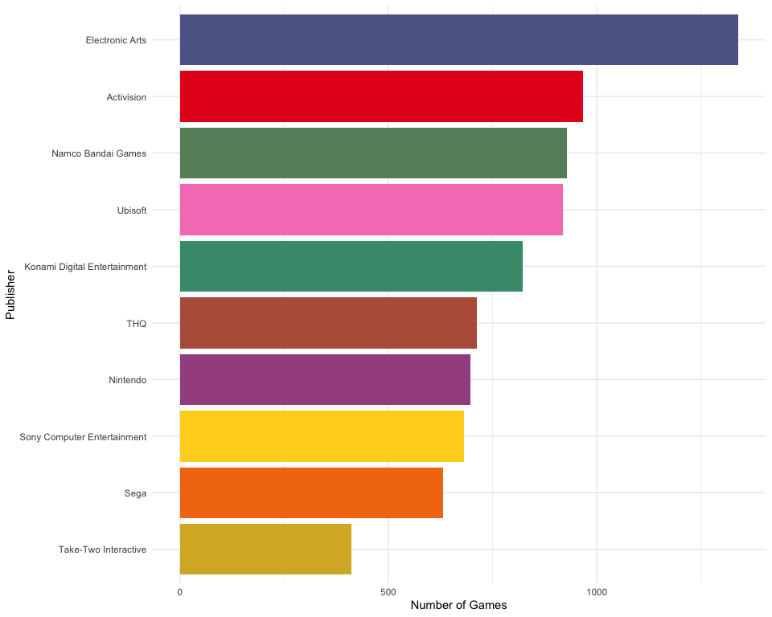

Video Games Dataset Analysis
================
Karat Sidhu

# Video Games

## Loading Libraries

``` r
library(tidyverse)
```

    ── Attaching packages ─────────────────────────────────────── tidyverse 1.3.1 ──

    ✓ ggplot2 3.3.5     ✓ purrr   0.3.4
    ✓ tibble  3.1.6     ✓ dplyr   1.0.8
    ✓ tidyr   1.2.0     ✓ stringr 1.4.0
    ✓ readr   2.1.2     ✓ forcats 0.5.1

    ── Conflicts ────────────────────────────────────────── tidyverse_conflicts() ──
    x dplyr::filter() masks stats::filter()
    x dplyr::lag()    masks stats::lag()

## Loading data

``` r
games_data <- read.csv("vgsales.csv",
                       na.strings = c(NA, "N/A", " NA"))
# the NA strings were weird here, so needed to add those arguments.
```

## Checking columns & data overview

``` r
as_tibble(lapply(games_data, class))
```

    # A tibble: 1 × 11
      Rank    Name      Platform  Year    Genre Publisher NA_Sales EU_Sales JP_Sales
      <chr>   <chr>     <chr>     <chr>   <chr> <chr>     <chr>    <chr>    <chr>   
    1 integer character character integer char… character numeric  numeric  numeric 
    # … with 2 more variables: Other_Sales <chr>, Global_Sales <chr>

``` r
head(games_data)
```

      Rank                     Name Platform Year        Genre Publisher NA_Sales
    1    1               Wii Sports      Wii 2006       Sports  Nintendo    41.49
    2    2        Super Mario Bros.      NES 1985     Platform  Nintendo    29.08
    3    3           Mario Kart Wii      Wii 2008       Racing  Nintendo    15.85
    4    4        Wii Sports Resort      Wii 2009       Sports  Nintendo    15.75
    5    5 Pokemon Red/Pokemon Blue       GB 1996 Role-Playing  Nintendo    11.27
    6    6                   Tetris       GB 1989       Puzzle  Nintendo    23.20
      EU_Sales JP_Sales Other_Sales Global_Sales
    1    29.02     3.77        8.46        82.74
    2     3.58     6.81        0.77        40.24
    3    12.88     3.79        3.31        35.82
    4    11.01     3.28        2.96        33.00
    5     8.89    10.22        1.00        31.37
    6     2.26     4.22        0.58        30.26

## Data Integrity Check

### Checking to see if any N/A’s are present in the data.

``` r
games_data %>%  
  summarise_all(~sum(is.na(.)))
```

      Rank Name Platform Year Genre Publisher NA_Sales EU_Sales JP_Sales
    1    0    0        0  271     0        58        0        0        0
      Other_Sales Global_Sales
    1           0            0

### Dropping N/A values

(just to make it easier to visualize)

``` r
games_data <- na.omit(games_data)
```

## Games per year

``` r
games_data %>% 
  group_by(Year) %>% 
  summarise(Total_Games = n()) %>% 
  ggplot(aes(x=Year, y=Total_Games)) +
  geom_col(color = "black", fill="tan") +
  theme_minimal() 
```


## Games per genre per year

``` r
games_data %>% 
  group_by(Year, Genre) %>% 
  summarise(Number = n()) %>% 
  as.tibble()
```

    Warning: `as.tibble()` was deprecated in tibble 2.0.0.
    Please use `as_tibble()` instead.
    The signature and semantics have changed, see `?as_tibble`.
    This warning is displayed once every 8 hours.
    Call `lifecycle::last_lifecycle_warnings()` to see where this warning was generated.

    `summarise()` has grouped output by 'Year'. You can override using the
    `.groups` argument.

    # A tibble: 389 × 3
        Year Genre    Number
       <int> <chr>     <int>
     1  1980 Action        1
     2  1980 Fighting      1
     3  1980 Misc          4
     4  1980 Shooter       2
     5  1980 Sports        1
     6  1981 Action       25
     7  1981 Platform      3
     8  1981 Puzzle        2
     9  1981 Racing        1
    10  1981 Shooter      10
    # … with 379 more rows

``` r
games_data %>% 
  group_by(Year, Genre) %>% 
  summarise(Number = n()) %>%
  ggplot(aes(x = Year, y = Number, color = Genre)) +
  geom_point(size = 2) +
  geom_line(size = 1) +
  scale_color_manual(
    values = c(
      Action = "#E41A1C",
      Adventure = "#75597F",
      Fighting = "#3D8B9A",
      Misc = "#4AAA54",
      Platform = "#757A7A",
      Puzzle = "#AA5685",
      Racing = "#EC761D",
      `Role-Playing` = "#FFB917",
      Shooter = "#F6EF31",
      Simulation = "#BE842A",
      Sports = "#C3655E",
      Strategy = "#F781BF"
    )
  ) +
  xlim(1980, 2016) +
  theme_minimal()
```

    `summarise()` has grouped output by 'Year'. You can override using the
    `.groups` argument.

    Warning: Removed 3 rows containing missing values (geom_point).

    Warning: Removed 3 row(s) containing missing values (geom_path).


## Top 5 Genres

(Top 6 calculated; added another since Misc was one of the categories)

``` r
games_data %>% 
  group_by(Genre) %>% 
  summarise(Total = n()) %>% 
  arrange(desc(Total)) %>% head(6) %>% 
  ggplot(aes(x= reorder(Genre, -Total), y= Total, fill= Genre)) +
  geom_col() + 
  scale_fill_manual(
    values = c(
      Action = "#E41A1C",
      Adventure = "#75597F",
      Misc = "#4AAA54",
      `Role-Playing` = "#FFB917",
      Shooter = "#F6EF31",
      Sports = "#C3655E"
    )
  ) +
  theme_minimal() +
  xlab(element_blank()) +
  ylab(element_blank()) +
  theme(legend.position = "none")
```


``` r
games_data %>%
  group_by(Genre, Year) %>%
  summarise(Total = n()) %>%
  filter(Genre %in% c("Action", "`Role-Playing`", "Shooter", "Sports", "Adventure")) %>%
  ungroup() %>%
  ggplot(aes(x = Year, y = Total, colour = Genre)) +
  geom_point(size = 2) +
  geom_line(size= 1) +
  scale_color_manual(
    values = c(
      Action = "#E41A1C",
      Adventure = "#75597F",
      `Role-Playing` = "#FFB917",
      Shooter = "#B9EF31",
      Sports = "#C3655E"
    )
  ) +
  xlim(1980, 2016) +
  theme_minimal()
```

    `summarise()` has grouped output by 'Genre'. You can override using the
    `.groups` argument.

    Warning: Removed 1 rows containing missing values (geom_point).

    Warning: Removed 1 row(s) containing missing values (geom_path).


## Global Sales Variation per year

``` r
games_data %>%
 filter(!(Year %in% c("2020", "2017"))) %>%
 ggplot() +
 aes(x =as.factor(Year), y = Global_Sales) +
 geom_boxplot(fill = "#FFFFFF") +
 scale_y_continuous(trans = "log10") +
  xlab(element_blank()) +
  ylab(element_blank())
```


## Top Grossing Games of all time

Looks like the data is already arranged in leading sales figure

``` r
games_data %>% 
  head(20) %>% 
  ggplot(aes(x=reorder(Name,-Global_Sales), y= Global_Sales, fill=Genre)) +
  geom_col() +
  scale_fill_manual(
    values = c(
      Action = "#1B9E77",
      Adventure = "#93752C",
      Fighting = "#BD6332",
      Misc = "#7E6EA2",
      Platform = "#B3499C",
      Puzzle = "#CF3F76",
      Racing = "#7D8F31",
      `Role-Playing` = "#A0A811",
      Shooter = "#E0A604",
      Simulation = "#B78415",
      Sports = "#8E7037",
      Strategy = "#666666"
    )
  ) +
  theme_minimal() +
  theme(axis.text.x = element_text(angle = 90, vjust = 0.5, hjust=1))
```


## Best Selling Games for each year

``` r
games_data %>% 
  group_by(Year) %>% 
  arrange(desc(Global_Sales)) %>% 
  slice(1) %>% 
  ggplot(aes(y =reorder(Year, -Year), x= Global_Sales, fill = Genre)) +
  geom_text(aes(label=Name), position=position_dodge(width=0.9), hjust=-0.05) +
  geom_col() +
  scale_fill_manual(
    values = c(
      Action = "#1B9E77",
      Adventure = "#93752C",
      Fighting = "#BD6332",
      Misc = "#7E6EA2",
      Platform = "#B3499C",
      Puzzle = "#CF3F76",
      Racing = "#7D8F31",
      `Role-Playing` = "#A0A811",
      Shooter = "#E0A604",
      Simulation = "#B78415",
      Sports = "#8E7037",
      Strategy = "#666666"
    )
  ) +
  theme_minimal() 
```


## Most Active Platform over the years

``` r
games_data %>% 
  group_by(Year, Platform) %>% 
  summarise(Total_Games = n()) %>% 
  arrange(Year) %>% 
  ggplot(aes(x = Year, y=Platform, fill = Total_Games)) +
  geom_tile() +
  scale_fill_gradient2(low = "darkgreen", mid = "white", high = "darkred", midpoint = 300) +
  theme_minimal()
```

    `summarise()` has grouped output by 'Year'. You can override using the
    `.groups` argument.


## Most Active Publisher (by number of Games)

``` r
publisher <- games_data %>% 
  group_by(Publisher) %>% 
  summarise(Total_Games = n()) %>%
  arrange(desc(Total_Games)) %>% 
  head(10)
```

``` r
ggplot(publisher, aes(x = reorder(Publisher, Total_Games), fill = Publisher, y = Total_Games)) +
  geom_col() +
  scale_fill_manual(
    values = c(Activision = "#E41A1C",
    `Electronic Arts` = "#5D6795",
    `Konami Digital Entertainment` = "#43997A",
    `Namco Bandai Games` = "#658E67",
    Nintendo = "#A35390",
    Sega = "#F37912",
    `Sony Computer Entertainment` = "#FFD422",
    `Take-Two Interactive` = "#D7B32E",
    THQ = "#B85F49",
    Ubisoft = "#F781BF")
  ) +
  labs(y = "Number of Games",
       x = "Publisher") +
  coord_flip() +
  theme_minimal() +
  theme(legend.position = "none")
```



## Nintendo Gaming

``` r
games_data %>%
  filter(Platform %in% c("Wii", "NES", "GB", "DS", "SNES", "3DS", "N64", "GC", "WiiU", "3DO")) %>%
  ggplot(aes(x = Platform, fill = Genre)) +
  geom_bar(position = "dodge") +
  scale_fill_manual(
    values = c(
      Action = "#1B9E77",
      Adventure = "#93752C",
      Fighting = "#BD6332",
      Misc = "#7E6EA2",
      Platform = "#B3499C",
      Puzzle = "#CF3F76",
      Racing = "#7D8F31",
      `Role-Playing` = "#A0A811",
      Shooter = "#E0A604",
      Simulation = "#B78415",
      Sports = "#8E7037",
      Strategy = "#666666"
    )
  ) +
  labs(
    x = "Platform",
    y = "Number of Games",
    title = "Nintendo Gaming",
    subtitle = "Comparing Different Nintendo platforms",
    fill = "Genre"
  ) +
  theme_minimal() +
  theme(plot.title = element_text(size = 18L,
                                  face = "bold")) +
  facet_wrap(vars(Genre), scales = "free")
```


## PC Gaming

``` r
games_data   %>%
  filter(Platform %in% "PC") %>% 
  ggplot() +
  aes(
    x = Year,
    y = Global_Sales,
    colour = Genre,
    group = Global_Sales
  ) +
  geom_jitter(size = 2.5) +
  scale_color_manual(
    values = c(
      Action = "#7FC97F",
      Adventure = "#A7B7B5",
      Fighting = "#CFB2BE",
      Misc = "#F7BE8D",
      Platform = "#FEE290",
      Puzzle = "#DAE49D",
      Racing = "#5C86AB",
      `Role-Playing` = "#8B3B99",
      Shooter = "#EB0A75",
      Simulation = "#CC4233",
      Sports = "#9E5F33",
      Strategy = "#666666"
    )
  ) +
  labs(y = "Global Sales",
       title = "PC Gaming Evolution",
       subtitle = "Global Sales through the years") +
  theme_minimal() +
  theme(
    plot.title = element_text(size = 20L,
                              face = "bold"),
    plot.subtitle = element_text(size = 14L, face = "italic")
  )
```


## 

## Correlation between Global vs all other sales

``` r
num_Sales=games_data[,c("NA_Sales","EU_Sales","JP_Sales","Other_Sales","Global_Sales")]
correlation <- cor(num_Sales)
```

``` r
ggcorrplot::ggcorrplot(correlation, hc.order = TRUE, outline.col = "white",
                       type = "lower",
                       colors = c("#6D9EC1", "white", "#E46726"),
                       lab = TRUE,
                       ggtheme = theme_minimal())
```


## 
