Netflix Movies
================
Karat Sidhu
2022-04-24

# Netflix Movies


## Loading libraries

``` r
suppressPackageStartupMessages(library(tidyverse))
suppressPackageStartupMessages(library(lubridate))
suppressPackageStartupMessages(library(showtext))
showtext.auto()
```

    ## 'showtext.auto()' is now renamed to 'showtext_auto()'
    ## The old version still works, but consider using the new function in future code

``` r
font_add_google("Bebas Neue", "Bebas Neue")
```

## Loading data

``` r
netflix <- read.csv("NetflixOriginals.csv")
```

## Looking at the data in brief

``` r
head(netflix, 4)
```

    ##             Title                 Genre          Premiere Runtime IMDB.Score
    ## 1 Enter the Anime           Documentary    August 5, 2019      58        2.5
    ## 2     Dark Forces              Thriller   August 21, 2020      81        2.6
    ## 3         The App Science fiction/Drama December 26, 2019      79        2.6
    ## 4  The Open House       Horror thriller  January 19, 2018      94        3.2
    ##           Language
    ## 1 English/Japanese
    ## 2          Spanish
    ## 3          Italian
    ## 4          English

### Type of datatype in each column

``` r
as.tibble(sapply(netflix, class))
```

    ## Warning: `as.tibble()` was deprecated in tibble 2.0.0.
    ## Please use `as_tibble()` instead.
    ## The signature and semantics have changed, see `?as_tibble`.
    ## This warning is displayed once every 8 hours.
    ## Call `lifecycle::last_lifecycle_warnings()` to see where this warning was generated.

    ## # A tibble: 6 × 1
    ##   value    
    ##   <chr>    
    ## 1 character
    ## 2 character
    ## 3 character
    ## 4 integer  
    ## 5 numeric  
    ## 6 character

### Does the data contain any N/A values?

``` r
any(is.na(netflix))
```

    ## [1] FALSE

## Converting the \`premier\` from chr to datetime

``` r
netflix <- netflix %>% 
  mutate(Released = mdy(Premiere))
```

## Getting each year, month and date separated

### Also adding the corresponding day of the week for each release

``` r
netflix <- netflix %>% 
  mutate(Year = year(Released)) %>% 
  mutate(Month = month(Released, label = TRUE)) %>% 
  mutate(Date = day(Released)) %>% 
  mutate(Day = wday(Released, label = TRUE, abbr = FALSE))
```

## When the movies were released

### Number of Movies released each year

``` r
netflix %>%
  group_by(Year) %>%
  summarise(total = n()) %>%
  ggplot(aes(
    x = Year,
    y = total,
    fill = ifelse(total == max(total), "red","grey"))) +
  geom_col() +
  labs(title = "Netflix Movies released each year") +
  theme_minimal() +
  scale_fill_manual(values = c("#2d2d2d", "#E50914")) +
  theme(
    legend.position = "none",
    plot.title = element_text(
      family = "Bebas Neue",
      size = 35,
      colour = "#E50914"
    ),
    axis.title.x = element_blank(),
    axis.title.y = element_blank(),
    panel.grid.major.x = element_blank(),
    panel.grid.minor  = element_blank(),
    text = element_text(size = 20))
```

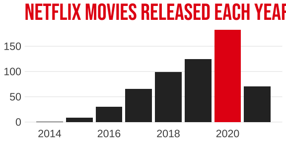<!-- -->

### Number of Movies released each month

``` r
netflix %>%
  group_by(Month) %>%
  summarise(total = n()) %>%
  ggplot(aes(
    x = Month,
    y = total,
    fill = ifelse(total == max(total), "red","grey"))) +
  geom_col() +
    labs(title = "Netflix Movies released each month") +
  theme_minimal() +
  scale_fill_manual(values = c( "#2d2d2d", "#E50914")) +
  theme(
    legend.position = "none",
    plot.title = element_text(
      family = "Bebas Neue",
      size = 30,
      colour = "#E50914"
    ),
    axis.title.x = element_blank(),
    axis.title.y = element_blank(),
    panel.grid.major.x = element_blank(),
    text = element_text(size = 20))
```

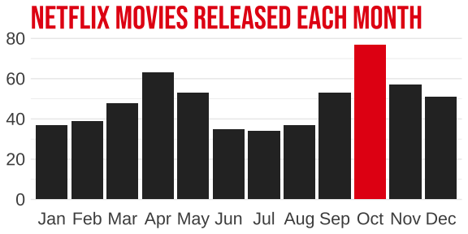<!-- -->

### Number of Movies released by date of the month

``` r
netflix %>%
  group_by(Date) %>%
  summarise(total = n()) %>%
  ggplot(aes(
    x = Date,
    y = total,
    fill = ifelse(total == max(total), "red","grey")))  +
  geom_col() +
    labs(title = "Netflix Movies released by Date of each month") +
  theme_minimal() +
  scale_fill_manual(values = c( "#2d2d2d", "#E50914")) +
  theme(
    legend.position = "none",
    plot.title = element_text(
      family = "Bebas Neue",
      size = 30,
      colour = "#E50914"
    ),
    axis.title.x = element_blank(),
    axis.title.y = element_blank(),
    panel.grid.major.x = element_blank(),
    panel.grid.minor = element_blank(),
    text = element_text(size = 20))
```

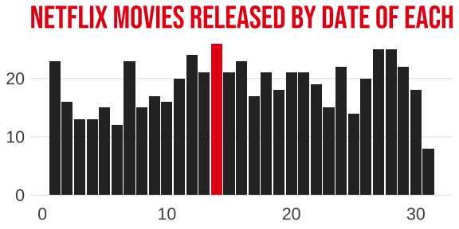<!-- -->

### Number of Movies released each day of the week

``` r
netflix %>%
  group_by(Day) %>%
  summarise(total = n()) %>%
  ggplot(aes(
    x = Day,
    y = total,
    fill = ifelse(total == max(total), "red","black"))) +
  geom_col() +
  labs(title = "Netflix Movies released by day of the week") +
  theme_minimal() +
  scale_fill_manual(values = c( "#2d2d2d", "#E50914")) +
  theme(
    legend.position = "none",
    plot.title = element_text(
      family = "Bebas Neue",
      size = 30,
      colour = "#E50914"
    ),
    axis.title.x = element_blank(),
    axis.title.y = element_blank(),
    panel.grid.major.x = element_blank(),
    text = element_text(size = 20))
```

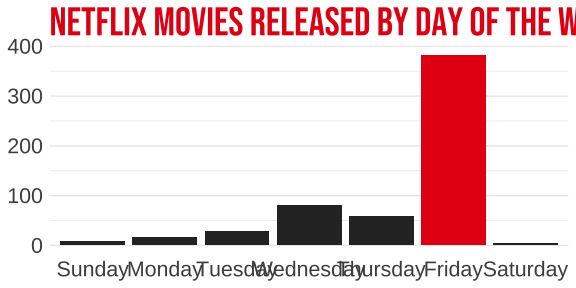<!-- -->

## Most Popular Genres

### 5 Most Popular Genres

``` r
netflix %>% 
  group_by(Genre) %>% 
  summarise(Movies = n()) %>% 
  arrange(desc(Movies)) %>% 
  head(5) %>% 
   ggplot(aes(
    x = reorder(Genre, -Movies),
    y = Movies,
    fill = ifelse(Movies == max(Movies), "red", "black"))) +
  geom_col() +
  labs(title = "Most Popular Genres") +
  theme_minimal() +
  scale_fill_manual(values = c( "#2d2d2d", "#E50914")) +
  theme(
    legend.position = "none",
    plot.title = element_text(
      family = "Bebas Neue",
      size = 30,
      colour = "#E50914"
    ),
    axis.title.x = element_blank(),
    axis.title.y = element_blank(),
    panel.grid.major.x = element_blank(),
    text = element_text(size = 20))
```

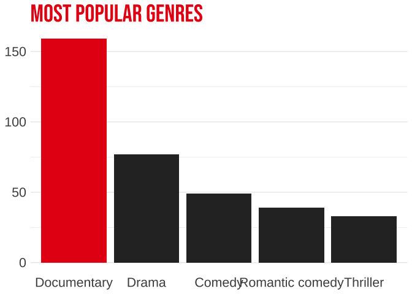<!-- -->

## Most Popular Languages

### 5 Most Popular Languages

``` r
netflix %>% 
  group_by(Language) %>% 
  summarise(Movies = n()) %>% 
  arrange(desc(Movies)) %>% 
  head(5) %>% 
   ggplot(aes(
    x = reorder(Language, -Movies),
    y = Movies,
    fill = ifelse(Movies == max(Movies), "red", "black"))) +
  geom_col() +
  labs(title = "Most Popular Languages") +
  theme_minimal() +
  scale_fill_manual(values = c( "#2d2d2d", "#E50914")) +
  theme(
    legend.position = "none",
    plot.title = element_text(
      family = "Bebas Neue",
      size = 30,
      colour = "#E50914"
    ),
    axis.title.x = element_blank(),
    axis.title.y = element_blank(),
    panel.grid.major.x = element_blank(),
    text = element_text(size = 20))
```

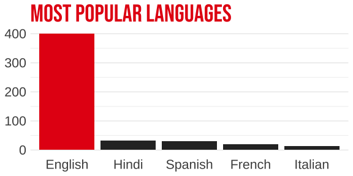<!-- -->

## IMDB Scores

### How were most movies rated?

``` r
netflix %>%
  ggplot(aes(x = `IMDB.Score`)) +
  geom_dotplot(binwidth = 0.1,
               fill = "#2d2d2d",
               color = "#e9ecef") +
  labs(title = "IMDB Score Distribution") +
  theme_minimal() +
  theme(
    legend.position = "none",
    plot.title = element_text(
      family = "Bebas Neue",
      size = 25,
      colour = "#E50914"
    ),
    axis.title.x = element_blank(),
    axis.title.y = element_blank(),
    panel.grid.major.x = element_blank()
  ) 
```

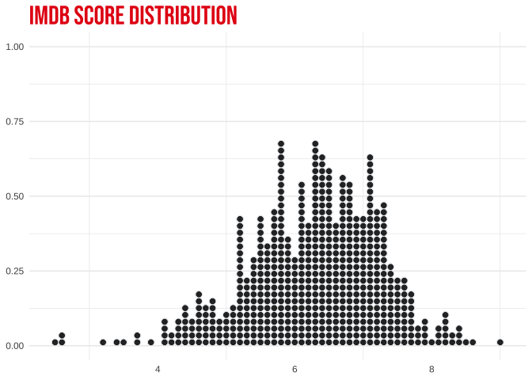<!-- -->

### Highest Rated Movies

``` r
netflix %>% 
  arrange(desc(`IMDB.Score`)) %>% 
  head(5) %>% 
   ggplot(aes(
    x = reorder(`Title`, `IMDB.Score`),
    y = `IMDB.Score`,
    fill = ifelse(`IMDB.Score` == max(`IMDB.Score`), "red", "black"))) +
  geom_col() +
  labs(title = "Highest Rated Movies") +
  theme_minimal() +
  scale_fill_manual(values = c( "#2d2d2d", "#E50914")) +
  coord_flip() +
  theme(
    legend.position = "none",
    plot.title = element_text(
      family = "Bebas Neue",
      size = 25,
      colour = "#E50914"
    ),
    axis.title.x = element_blank(),
    axis.title.y = element_blank(),
    panel.grid.major.x = element_blank())
```

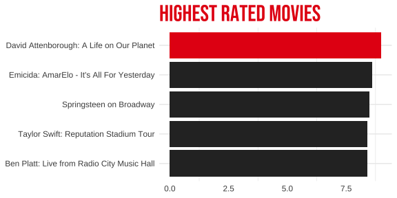<!-- -->

### Lowest Rated Movies

``` r
netflix %>% 
  arrange(desc(-`IMDB.Score`)) %>% 
  head(5) %>% 
  ggplot(aes(
    x = reorder(`Title`, -`IMDB.Score`),
    y = `IMDB.Score`,
    fill = ifelse(`IMDB.Score` == min(`IMDB.Score`), "red", "black"))) +
  geom_col() +
  labs(title = "Lowest Rated Movies") +
  theme_minimal() +
  scale_fill_manual(values = c( "#2d2d2d", "#E50914")) +
  coord_flip() +
  theme(
    legend.position = "none",
    plot.title = element_text(
      family = "Bebas Neue",
      size = 25,
      colour = "#E50914"
    ),
    axis.title.x = element_blank(),
    axis.title.y = element_blank(),
    panel.grid.major.x = element_blank())
```

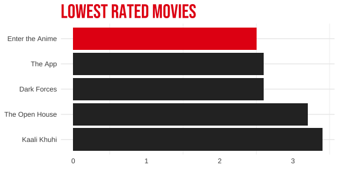<!-- -->

## Runtime

### How long are the movies?

``` r
netflix %>%
  ggplot(aes(x = Runtime)) +
  geom_dotplot(binwidth = 2.25,
               fill = "#2d2d2d",
               color = "#e9ecef") +
  labs(title = "Movie Runtime") +
  theme_minimal() +
  theme(
    legend.position = "none",
    plot.title = element_text(
      family = "Bebas Neue",
      size = 25,
      colour = "#E50914"
    ),
    axis.title.x = element_blank(),
    axis.title.y = element_blank(),
    panel.grid.major.x = element_blank()
  ) 
```

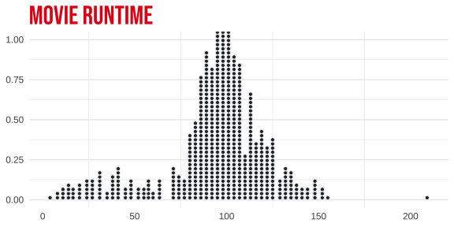<!-- -->

### Longest Movies

``` r
netflix %>% 
  arrange(desc(Runtime)) %>% 
  head(5) %>% 
  ggplot(aes(
    x = reorder(`Title`, `Runtime`),
    y = `Runtime`,
    fill = ifelse(Runtime == max(`Runtime`), "red", "black"))) +
  geom_col() +
  labs(title = "Longest Movies") +
  theme_minimal() +
  scale_fill_manual(values = c( "#2d2d2d", "#E50914")) +
  coord_flip() +
  theme(
    legend.position = "none",
    plot.title = element_text(
      family = "Bebas Neue",
      size = 25,
      colour = "#E50914"
    ),
    axis.title.x = element_blank(),
    axis.title.y = element_blank(),
    panel.grid.major.x = element_blank())
```

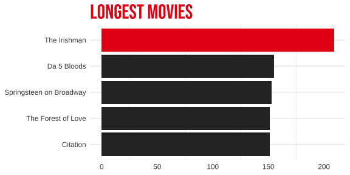<!-- -->

### Shortest Movies

``` r
netflix %>% 
  arrange(desc(-Runtime)) %>% 
  head(5) %>% 
  ggplot(aes(
    x = reorder(`Title`, `Runtime`),
    y = `Runtime`,
    fill = ifelse(Runtime == min(`Runtime`), "red", "black"))) +
  geom_col() +
  labs(title = "Shortest Movies") +
  theme_minimal() +
  scale_fill_manual(values = c( "#2d2d2d", "#E50914")) +
  coord_flip() +
  theme(
    legend.position = "none",
    plot.title = element_text(
      family = "Bebas Neue",
      size = 25,
      colour = "#E50914"
    ),
    axis.title.x = element_blank(),
    axis.title.y = element_blank(),
    panel.grid.major.x = element_blank(),
    text = element_text(size = 20))
```

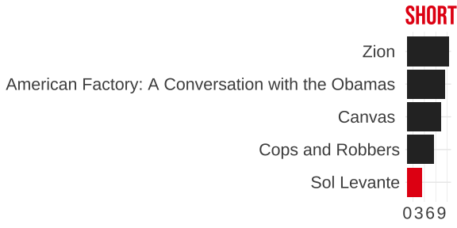<!-- -->

## Runtime vs IMDB-Score

``` r
netflix %>% 
  ggplot(aes(x=`IMDB.Score`, y= Runtime)) +
  geom_point() +
  geom_smooth(method = lm,colour = "#E50914") +
  labs(title = "Runtime vs IMDB Rating") +
  theme_minimal() +
  scale_fill_manual(values = c( "#2d2d2d", "#E50914")) +
  theme(
    legend.position = "none",
    plot.title = element_text(
      family = "Bebas Neue",
      size = 25,
      colour = "#E50914"
    ),
    axis.title.x = element_blank(),
    axis.title.y = element_blank(),
    panel.grid.major.x = element_blank())
```

    ## `geom_smooth()` using formula 'y ~ x'

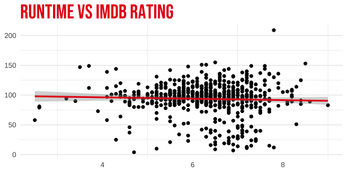<!-- -->

## Basic Statistical Analysis

### Linear Models

``` r
model <- lm(data = netflix, formula = Runtime ~ `IMDB.Score`)
summary(model)
```

    ## 
    ## Call:
    ## lm(formula = Runtime ~ IMDB.Score, data = netflix)
    ## 
    ## Residuals:
    ##     Min      1Q  Median      3Q     Max 
    ## -91.399  -7.439   3.398  14.467 117.195 
    ## 
    ## Coefficients:
    ##             Estimate Std. Error t value Pr(>|t|)    
    ## (Intercept)  100.849      7.453  13.531   <2e-16 ***
    ## IMDB.Score    -1.159      1.174  -0.987    0.324    
    ## ---
    ## Signif. codes:  0 '***' 0.001 '**' 0.01 '*' 0.05 '.' 0.1 ' ' 1
    ## 
    ## Residual standard error: 27.76 on 582 degrees of freedom
    ## Multiple R-squared:  0.001673,   Adjusted R-squared:  -4.283e-05 
    ## F-statistic: 0.975 on 1 and 582 DF,  p-value: 0.3238

### Correlation Test

``` r
res <- cor.test(netflix$Runtime, netflix$IMDB.Score, 
                    method = "pearson")
res
```

    ## 
    ##  Pearson's product-moment correlation
    ## 
    ## data:  netflix$Runtime and netflix$IMDB.Score
    ## t = -0.98744, df = 582, p-value = 0.3238
    ## alternative hypothesis: true correlation is not equal to 0
    ## 95 percent confidence interval:
    ##  -0.12162699  0.04037194
    ## sample estimates:
    ##         cor 
    ## -0.04089629

### P-value

``` r
res$p.value
```

    ## [1] 0.3238393

### Correlation Coefficient

``` r
res$estimate
```

    ##         cor 
    ## -0.04089629

## Thank you!


