## Goodreads Data

# Loading Packages

``` r
library(tidyverse)
```

    ── Attaching packages ─────────────────────────────────────── tidyverse 1.3.1 ──

    ✓ ggplot2 3.3.5     ✓ purrr   0.3.4
    ✓ tibble  3.1.6     ✓ dplyr   1.0.8
    ✓ tidyr   1.2.0     ✓ stringr 1.4.0
    ✓ readr   2.1.2     ✓ forcats 0.5.1

    ── Conflicts ────────────────────────────────────────── tidyverse_conflicts() ──
    x dplyr::filter() masks stats::filter()
    x dplyr::lag()    masks stats::lag()

``` r
library(corrplot)
```

    corrplot 0.92 loaded

``` r
library(pheatmap)
```

# Loading Data

``` r
books <- read_csv("books.csv")
```

    Warning: One or more parsing issues, see `problems()` for details

    Rows: 11127 Columns: 12
    ── Column specification ────────────────────────────────────────────────────────
    Delimiter: ","
    chr (7): title, authors, isbn, isbn13, language_code, publication_date, publ...
    dbl (5): bookID, average_rating, num_pages, ratings_count, text_reviews_count

    ℹ Use `spec()` to retrieve the full column specification for this data.
    ℹ Specify the column types or set `show_col_types = FALSE` to quiet this message.

# Data Summary

``` r
books %>% summary
```

         bookID         title             authors          average_rating 
     Min.   :    1   Length:11127       Length:11127       Min.   :0.000  
     1st Qu.:10287   Class :character   Class :character   1st Qu.:3.770  
     Median :20287   Mode  :character   Mode  :character   Median :3.960  
     Mean   :21311                                         Mean   :3.934  
     3rd Qu.:32104                                         3rd Qu.:4.140  
     Max.   :45641                                         Max.   :5.000  
                                                           NA's   :4      
         isbn              isbn13          language_code        num_pages     
     Length:11127       Length:11127       Length:11127       Min.   :   0.0  
     Class :character   Class :character   Class :character   1st Qu.: 192.0  
     Mode  :character   Mode  :character   Mode  :character   Median : 299.0  
                                                              Mean   : 336.4  
                                                              3rd Qu.: 416.0  
                                                              Max.   :6576.0  
                                                              NA's   :4       
     ratings_count     text_reviews_count publication_date    publisher        
     Min.   :      0   Min.   :    0.0    Length:11127       Length:11127      
     1st Qu.:    104   1st Qu.:    9.0    Class :character   Class :character  
     Median :    745   Median :   47.0    Mode  :character   Mode  :character  
     Mean   :  17936   Mean   :  541.9                                         
     3rd Qu.:   4994   3rd Qu.:  237.5                                         
     Max.   :4597666   Max.   :94265.0                                         
                                                                               

# Ratings Distribution

``` r
books %>%
  ggplot() +
  aes(x = (average_rating)) +
  geom_histogram(bins = 50) +
  theme_minimal() +
  theme(
    panel.grid.major.x = element_blank(),
    panel.grid.minor = element_blank()
  )
```

    Warning: Removed 4 rows containing non-finite values (stat_bin).

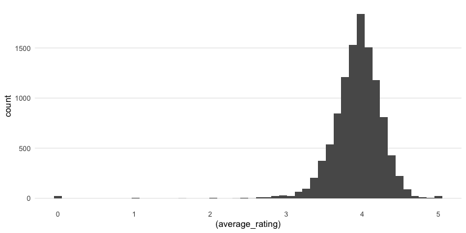

# Number of Pages Distribution

``` r
books %>%
  ggplot() +
  aes(x = (num_pages)) +
  geom_histogram(bins = 50) +
  theme_minimal() +
  theme(
    panel.grid.major.x = element_blank(),
    panel.grid.minor = element_blank()
  )
```

    Warning: Removed 4 rows containing non-finite values (stat_bin).

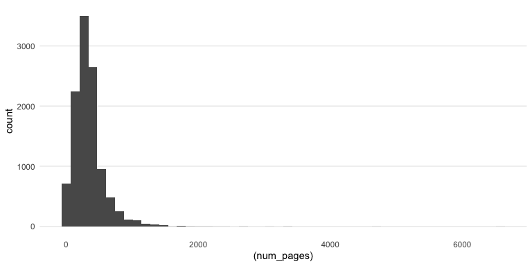

# Most Occurring Books in the data

``` r
books %>%
  group_by(title) %>%
  summarise(count = n()) %>%
  arrange(desc(count)) %>%
  head(25) %>%
  ggplot(aes(
    x = reorder(title, count),
    y = count,
    fill =as.factor(count)
  )) +
  geom_col() +
  coord_flip() +
  scale_y_continuous(breaks = c(1:10)) +
  theme_minimal() +
  theme(legend.position = "none",
        axis.title = element_blank())
```

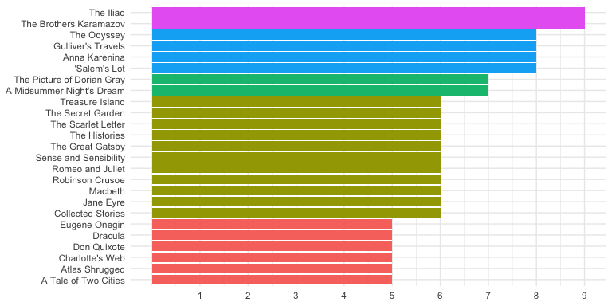

# Most Common Languages

``` r
books %>%
  group_by(language_code) %>%
  summarise(count = n()) %>%
  arrange(desc(count)) %>%
  head(10) %>%
  ggplot(aes(
    x = reorder(language_code, -count),
    y = count,
    fill =as.factor(count)
  )) +
  geom_col() +
  theme_minimal() +
  theme(legend.position = "none",
        axis.title = element_blank())
```

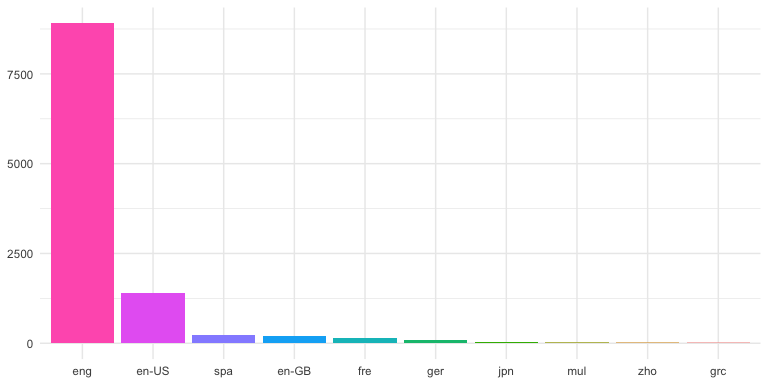

# Most Rated Books

``` r
books %>% 
  arrange(desc(ratings_count)) %>% 
  head(15) %>% 
    ggplot(aes(
    x = reorder(title, ratings_count),
    y = ratings_count,
    fill =as.factor(ratings_count)
  )) +
  geom_col() +
  theme_minimal() +
  theme(legend.position = "none",
        axis.title = element_blank()) +
  coord_flip()
```

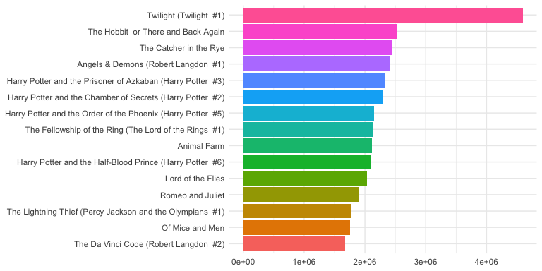

# Authors with most number of books

``` r
books %>% 
  group_by(authors) %>% 
  summarise(total_books = n()) %>% 
  arrange(desc(total_books)) %>% 
  head(15) %>% 
  ggplot(aes(
    x = reorder(authors, total_books),
    y = total_books,
    fill =as.factor(total_books)
  )) +
  geom_col() +
  theme_minimal() +
  theme(legend.position = "none",
        axis.title = element_blank()) +
  coord_flip()
```

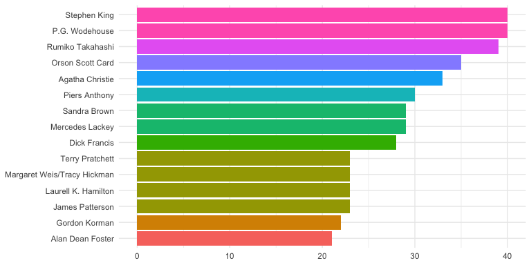

# Books with the most reviews

``` r
books %>% 
  arrange(desc(text_reviews_count)) %>% 
  head(15) %>% 
    ggplot(aes(
    x = reorder(title, text_reviews_count),
    y = text_reviews_count,
    fill =as.factor(text_reviews_count)
  )) +
  geom_col() +
  theme_minimal() +
  theme(legend.position = "none",
        axis.title = element_blank()) +
  coord_flip()
```

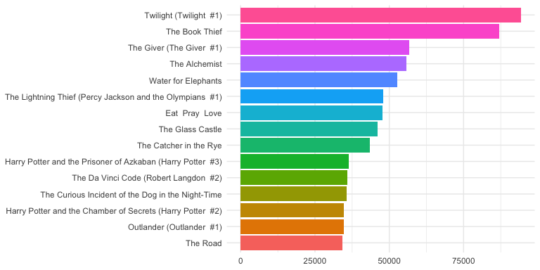

# Longest Books (By Page Count)

``` r
books %>% 
  arrange(desc(num_pages)) %>% 
  head(7) %>% 
    ggplot(aes(
    x = reorder(title, num_pages),
    y = num_pages,
    fill =as.factor(num_pages)
  )) +
  geom_col() +
  theme_minimal() +
  theme(legend.position = "none",
        axis.title = element_blank()) +
  coord_flip()
```

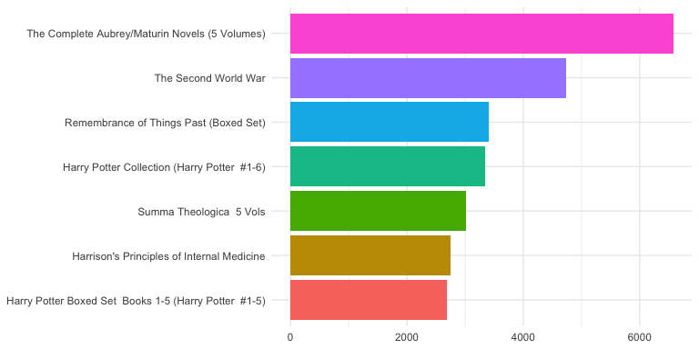

# Most common publishers

``` r
books %>% 
  group_by(publisher) %>% 
  summarise(total_books = n()) %>% 
  arrange(desc(total_books)) %>% 
  head(15) %>% 
  ggplot(aes(
    x = reorder(publisher, total_books),
    y = total_books,
    fill =as.factor(total_books)
  )) +
  geom_col() +
  theme_minimal() +
  theme(legend.position = "none",
        axis.title = element_blank()) +
  coord_flip()
```

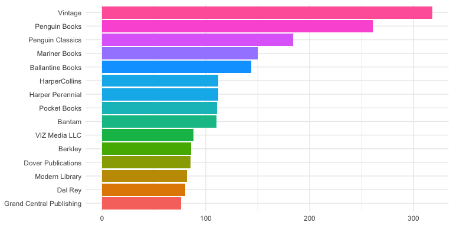

# Highest Rated Books

``` r
books %>% 
  arrange(desc(average_rating)) %>% 
  head(15)
```

    # A tibble: 15 × 12
       bookID title      authors average_rating isbn  isbn13 language_code num_pages
        <dbl> <chr>      <chr>            <dbl> <chr> <chr>  <chr>             <dbl>
     1   2034 Comoediae… Aristo…              5 0198… 97801… grc                 364
     2   2560 Willem de… Julie …              5 3829… 97838… eng                  83
     3   2843 Literatur… Tara M…              5 0439… 97804… eng                  32
     4   4287 Middlesex… Middle…              5 0738… 97807… eng                 128
     5  14741 Zone of t… Tim Bo…              5 0744… 97807… eng                 128
     6  17224 The Diamo… John  …              5 1890… 97818… eng                  74
     7  17830 Bulgakov'… Elena …              5 0533… 97805… eng                 202
     8  18184 The Compl… Ian   …              5 0851… 97808… eng                  96
     9  19786 The Goon … NOT A …              5 0563… 97805… eng                   2
    10  19788 The Goon … NOT A …              5 0563… 97805… eng                   2
    11  20954 Wincheste… Dennis…              5 0785… 97807… eng                 372
    12  20957 Colossian… R. McL…              5 0567… 97805… eng                 512
    13  23276 Taxation … Ross G…              5 0198… 97801… eng                 350
    14  23552 The New B… Todd D…              5 0762… 97807… eng                  56
    15  25426 Delwau Du… Nichol…              5 0862… 97808… wel                 150
    # … with 4 more variables: ratings_count <dbl>, text_reviews_count <dbl>,
    #   publication_date <chr>, publisher <chr>

``` r
books %>% 
  arrange(desc(average_rating)) %>% 
  head(15) %>% 
    ggplot(aes(
    x = reorder(title, average_rating),
    y = average_rating,
    fill =as.factor(title)
  )) +
  geom_col() +
  theme_minimal() +
  theme(legend.position = "none",
        axis.title = element_blank(),
        axis.text = element_text(size = 4)) +
  coord_flip()
```

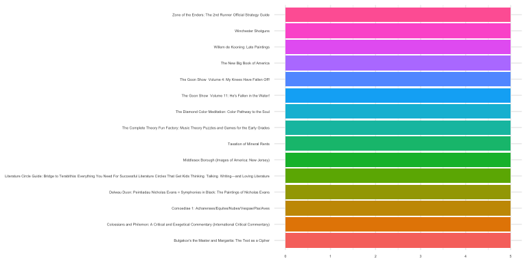

# Lowest Rated Books

``` r
books %>%
  filter(average_rating !=0) %>% 
  arrange(desc(average_rating)) %>% 
  head(15)
```

    # A tibble: 15 × 12
       bookID title      authors average_rating isbn  isbn13 language_code num_pages
        <dbl> <chr>      <chr>            <dbl> <chr> <chr>  <chr>             <dbl>
     1   2034 Comoediae… Aristo…              5 0198… 97801… grc                 364
     2   2560 Willem de… Julie …              5 3829… 97838… eng                  83
     3   2843 Literatur… Tara M…              5 0439… 97804… eng                  32
     4   4287 Middlesex… Middle…              5 0738… 97807… eng                 128
     5  14741 Zone of t… Tim Bo…              5 0744… 97807… eng                 128
     6  17224 The Diamo… John  …              5 1890… 97818… eng                  74
     7  17830 Bulgakov'… Elena …              5 0533… 97805… eng                 202
     8  18184 The Compl… Ian   …              5 0851… 97808… eng                  96
     9  19786 The Goon … NOT A …              5 0563… 97805… eng                   2
    10  19788 The Goon … NOT A …              5 0563… 97805… eng                   2
    11  20954 Wincheste… Dennis…              5 0785… 97807… eng                 372
    12  20957 Colossian… R. McL…              5 0567… 97805… eng                 512
    13  23276 Taxation … Ross G…              5 0198… 97801… eng                 350
    14  23552 The New B… Todd D…              5 0762… 97807… eng                  56
    15  25426 Delwau Du… Nichol…              5 0862… 97808… wel                 150
    # … with 4 more variables: ratings_count <dbl>, text_reviews_count <dbl>,
    #   publication_date <chr>, publisher <chr>

``` r
books %>%
  filter(average_rating !=0) %>% 
  arrange(desc(average_rating)) %>% 
  head(15) %>% 
    ggplot(aes(
    x = reorder(title, 
                average_rating),
    y = average_rating,
    fill =(average_rating)
  )) +
  geom_col() +
  theme_minimal() +
  theme(legend.position = "none",
        axis.title = element_blank()) +
  coord_flip()
```

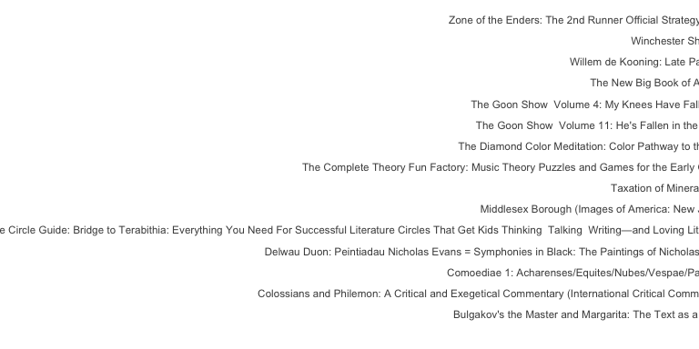

# Ratings vs Reviews Count Correlation

``` r
books %>%
  ggplot(aes(x = ratings_count,
             y = text_reviews_count)) +
  geom_point() +
  geom_smooth(formula = y ~ x,
              method = lm) +
  theme_minimal()
```

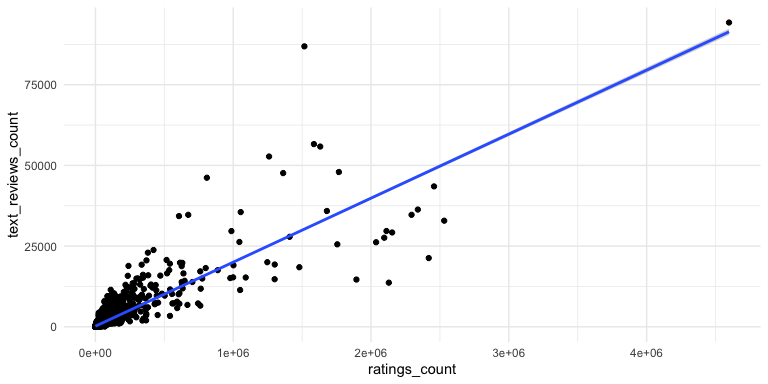

# Average Ratings vs Reviews Correlation?

``` r
books %>%
  ggplot(aes(y = average_rating,
             x = text_reviews_count)) +
  geom_point() +
  geom_smooth(formula = y ~ x,
              method = lm) +
  theme_minimal()
```

    Warning: Removed 4 rows containing non-finite values (stat_smooth).

    Warning: Removed 4 rows containing missing values (geom_point).

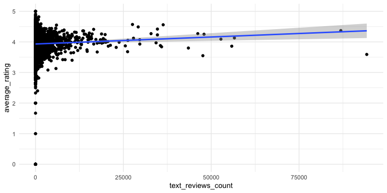

# Average Ratings vs Ratings Correlation?

``` r
books %>%
  ggplot(aes(y = average_rating,
             x = ratings_count)) +
  geom_point() +
  geom_smooth(formula = y ~ x,
              method = lm) +
  theme_minimal()
```

    Warning: Removed 4 rows containing non-finite values (stat_smooth).

    Warning: Removed 4 rows containing missing values (geom_point).

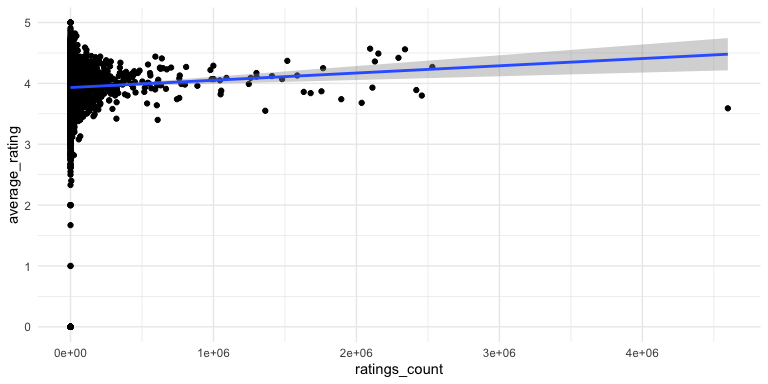

# Average Ratings vs Num Pages Correlation?

``` r
books %>%
  ggplot(aes(y = average_rating,
             x = num_pages)) +
  geom_point() +
  geom_smooth(formula = y ~ x,
              method = lm) +
  theme_minimal()
```

    Warning: Removed 4 rows containing non-finite values (stat_smooth).

    Warning: Removed 4 rows containing missing values (geom_point).

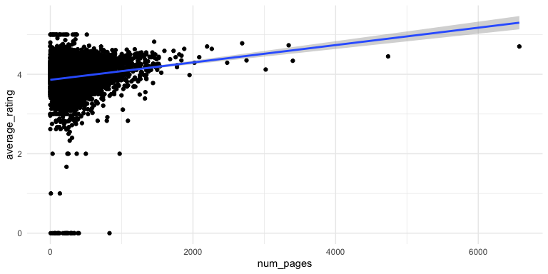

# Correlation between numeric data

``` r
books %>%
  select(ratings_count,
         text_reviews_count,
         num_pages,
         average_rating) %>%
  filter(ratings_count > 0,
         text_reviews_count > 0,
         num_pages > 0,
    average_rating > 0) %>%
  cor() %>%
  corrplot(
type = "lower",
order = "hclust",
method = "color",
addgrid.col = "darkgray",
 outline = T,
 tl.cex = 1,
 tl.col = "black"
)
```

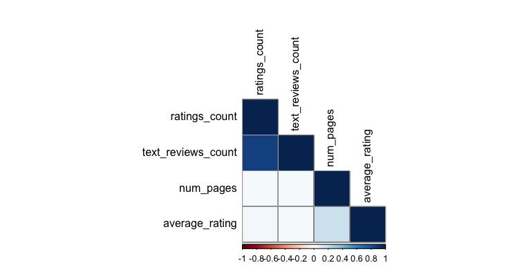

# Clustering top 75 most rated books

``` r
books %>% 
  select(ratings_count,
         text_reviews_count,
         num_pages,
         average_rating, title) %>% 
  arrange(desc(ratings_count)) %>% 
  head(75) %>% 
  remove_rownames() %>% 
  column_to_rownames(var = "title") %>% 
  mutate_all(scale) %>% 
pheatmap(
  border_color = "black",
  cluster_col = T,
  cutree_rows = 3
)
```

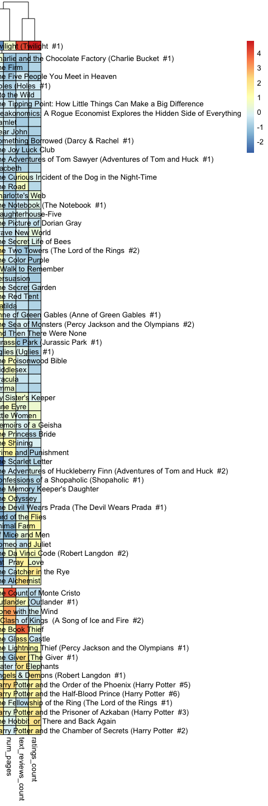
